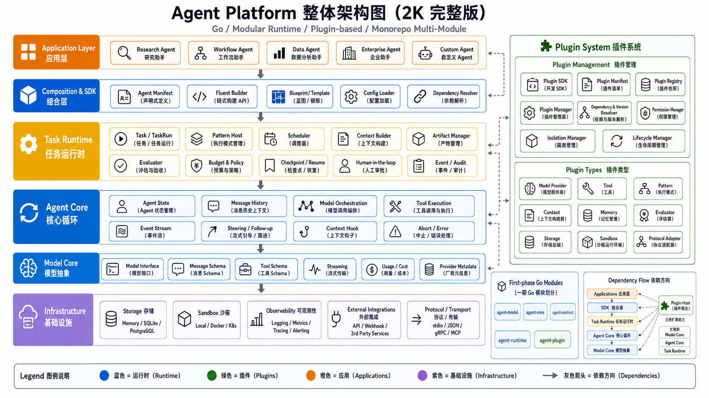
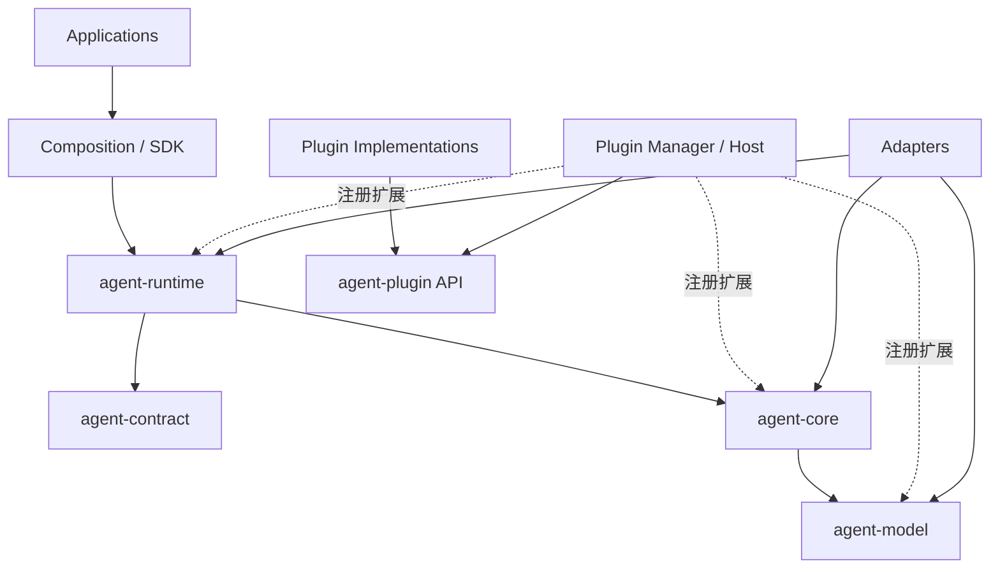

# Agent Platform 总体架构 v0.1

> 状态：Architecture Draft  
> 目标：定义系统分层、模块职责、依赖方向、插件平面与第一阶段代码组织。

## 1. 架构图



> 上图用于表达完整愿景。v0.1 不会实现图中所有组件，具体范围以 PRD 和 Roadmap 为准。

## 2. 架构目标

系统需要同时满足：

- 核心 Agent Loop 可独立使用
- Task Runtime 与具体 Agent 应用解耦
- 模型、工具、Pattern、Memory、Evaluator、Storage 可替换
- 任务具备状态、预算、产物、证据和验收
- 插件可被发现、校验、加载和限制权限
- 本地嵌入、CLI、服务端和私有化部署均可演进
- Go 核心可以连接 MCP 和其他语言实现

## 3. 分层架构

### 3.1 Application Layer

具体 Agent 产品和业务应用：

```text
Research Agent
Workflow Agent
Data Agent
Enterprise Agent
Custom Agent
```

应用层可以拥有自己的：

- Prompt
- 默认 Agent Manifest
- Skill / Domain Logic
- UI
- 业务规则
- 默认 Tool 和 Evaluator

应用层不能反向成为 Runtime Core 的依赖。

### 3.2 Composition & SDK Layer

负责把模块组装成 Agent：

- Agent Manifest
- Fluent Builder
- Blueprint / Template
- Config Loader
- Dependency Resolver
- Capability Matching
- 配置校验

组合关系：

```text
Agent
=
Pattern
+ Model Policy
+ Tools
+ Context Policy
+ Memory
+ Evaluators
+ Storage
+ Security Policy
```

### 3.3 Task Runtime Layer

管理一个 Task 的完整生命周期：

- Task / TaskRun
- Pattern Host
- Plan / Graph
- Scheduler
- Context Builder
- Artifact Manager
- Evaluator
- Budget / Policy
- Event / Audit
- Checkpoint / Resume
- Human-in-the-loop
- Retry / Recovery
- Subtask（后续）

Task Runtime 关心“任务能否可靠完成”，但不实现具体模型 Provider 和业务 Tool。

### 3.4 Agent Core Layer

最小 Agent 循环运行时：

- Agent State
- Message History
- Model Orchestration
- Tool Execution
- Event Stream
- Steering / Follow-up
- Context Transform Hook
- Abort / Error Handling

核心循环：

```text
Message
→ Model
→ Tool Calls
→ Tool Results
→ Model
→ Final Message
```

Agent Core 不负责：

- Task 生命周期
- 数据库
- Human Approval
- Multi-Agent
- 具体 Research 或 Workflow 逻辑
- 插件市场

### 3.5 Model Abstraction Layer

统一模型能力：

- Model Interface
- Message / Tool Schema
- Streaming Event
- Token / Usage
- Provider Metadata
- Error / Retry Mapping

具体 OpenAI、Anthropic、本地模型等位于 Adapter 或插件层。

### 3.6 Protocol & Transport Layer

支持跨进程、跨语言和远程接入：

- Protocol Schema
- JSON / CBOR
- stdio / WebSocket / gRPC
- Session
- AuthN / AuthZ
- Flow Control

v0.1 只需保证内部 DTO 可序列化，并优先支持 JSON / stdio。

### 3.7 Infrastructure Layer

可替换基础设施：

- Storage：Memory、SQLite、PostgreSQL、Object Store
- Sandbox：Local、Docker、Kubernetes、Remote
- Observability：Logging、Metrics、Tracing、Alerting
- External Integration：企业 API、消息队列、Webhook

## 4. 插件系统

插件系统是纵向扩展平面，不是单独的 Tool 目录。

### 4.1 插件类型

```text
Model Provider
Tool / Capability
Pattern / Strategy
Context Builder
Memory
Evaluator
Storage Backend
Sandbox / Runtime
Protocol Adapter
Skill / Domain Logic
```

### 4.2 插件管理组件

- Plugin SDK
- Plugin Manifest
- Plugin Registry
- Plugin Manager
- Dependency & Version Resolver
- Capability Matching
- Permission Manager
- Signature Verification
- Isolation Manager
- Lifecycle Manager
- Compatibility Gate

### 4.3 插件运行方式

#### 静态 In-process

适合官方可信 Go 插件：

- 类型安全
- 性能好
- 调试简单
- 随主程序发布

#### 独立进程 Out-of-process

适合第三方或多语言插件：

- 进程隔离
- 独立升级
- 可限制资源
- 通过 RPC 通信

#### Remote / MCP

适合外部 Tool 和远程服务：

- 生态兼容
- 独立部署
- 可跨语言和组织

v0.1 默认顺序：

```text
静态注册
→ MCP Tool Adapter
→ 实验性独立进程
```

## 5. 控制平面与数据平面

### 控制平面

负责：

- Agent 定义
- Plugin Registry
- Manifest
- Dependency Resolution
- Version 和权限策略
- 配置和部署

### 数据平面

负责：

- Task 执行
- Agent Loop
- Model / Tool 调用
- Event
- Artifact
- Evaluation
- Checkpoint

控制平面不应参与每个 Token 和 Tool Call 的热路径。

## 6. 首批 Go Module

```text
agent-model
agent-core
agent-contract
agent-runtime
agent-plugin
```

### 6.1 agent-model

负责：

- Message
- Tool Schema
- Model Interface
- Streaming Event
- Usage
- Error

不负责 Agent Loop。

### 6.2 agent-core

负责：

- Agent State
- Model/Tool Loop
- Event Stream
- Context Hook
- Steering
- Abort

不负责 Task 生命周期和持久化。

### 6.3 agent-contract

负责纯协议类型：

- Task
- TaskResult
- ArtifactRef
- Capability
- Constraint
- Permission
- Budget
- Acceptance

不依赖执行模块。

### 6.4 agent-runtime

负责：

- TaskRun
- Pattern Host
- Scheduler
- Context Builder
- Artifact
- Evaluator
- Policy
- Budget
- Checkpoint
- Human Approval

### 6.5 agent-plugin

v0.1 负责：

- Plugin API
- Manifest
- Registry
- Static Registration
- Version / Type Validation
- Lifecycle
- MCP Tool Adapter 接入点

## 7. 依赖方向



禁止的依赖：

```text
agent-model → agent-core
agent-core → agent-runtime
agent-contract → 执行模块
核心模块 → OpenAI SDK / SQLite / Docker
runtime → 具体业务应用
```

## 8. 典型执行流程

```text
1. 开发者定义 Agent Manifest
2. Composition Layer 校验配置
3. Plugin Manager 解析并注册依赖
4. 用户或系统提交 Task
5. Task Runtime 创建 TaskRun
6. Pattern 决定下一步执行意图
7. Agent Core 执行模型与 Tool Loop
8. Event、Artifact 和 Evidence 被持久化
9. Evaluator 执行验收
10. Runtime 返回 TaskResult
```

## 9. Monorepo 结构

```text
agent-platform/
├── go.work
├── model/
├── agent/
├── contract/
├── runtime/
├── plugin/
├── adapters/
│   ├── models/
│   ├── tools/
│   ├── storage/
│   └── sandbox/
├── apps/
├── examples/
├── schemas/
├── docs/
└── tests/
```

架构稳定后，Module 名称可调整为更完整的导入路径，但第一阶段保持少量 Module。

## 10. 关键领域对象

```text
AgentDefinition
Task
TaskRun
PatternState
Decision
ExecutionResult
Message
ToolCall
Artifact
Evidence
Evaluation
Event
Checkpoint
PluginDescriptor
Capability
Policy
```

这些只是领域概念。详细字段要经过 Spike 后再冻结。

## 11. 架构原则

1. 分层清晰，依赖向下。
2. Agent Core 小于 Task Runtime。
3. 公共协议和实现分离。
4. 插件通过注册扩展，不直接修改 Core。
5. 单 Agent 为默认执行方式。
6. 确定性步骤优先使用 Node / Tool / Evaluator。
7. 权限最小化，Secret 使用引用。
8. 所有长任务都可观察。
9. 对外接口少而稳定。
10. 先垂直验证，再扩大抽象。

## 12. 待技术 Spike 验证的问题

- 不同 Provider 的流式 Tool Call 如何统一
- Agent Event Stream 的最小事件集合
- Pattern 的输入输出是否采用 Decision 模型
- Checkpoint 应保存事件还是完整状态快照
- Plugin Manifest 的最小字段
- 独立进程插件采用哪种 RPC
- Task Contract 的字段边界
- Artifact 与 Evidence 是否分开建模
- Runtime 内部是否需要 Graph，还是先使用状态机
